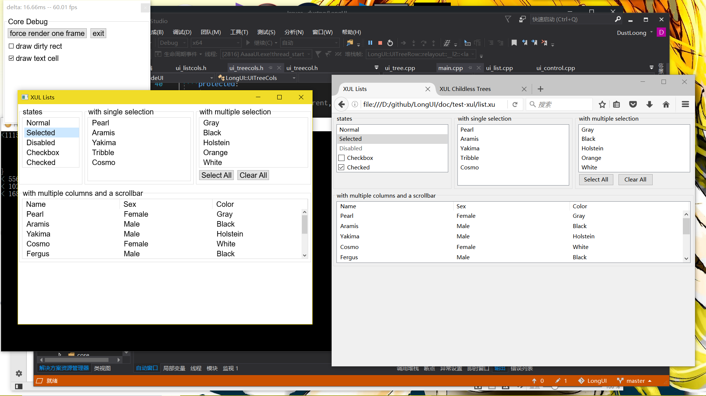
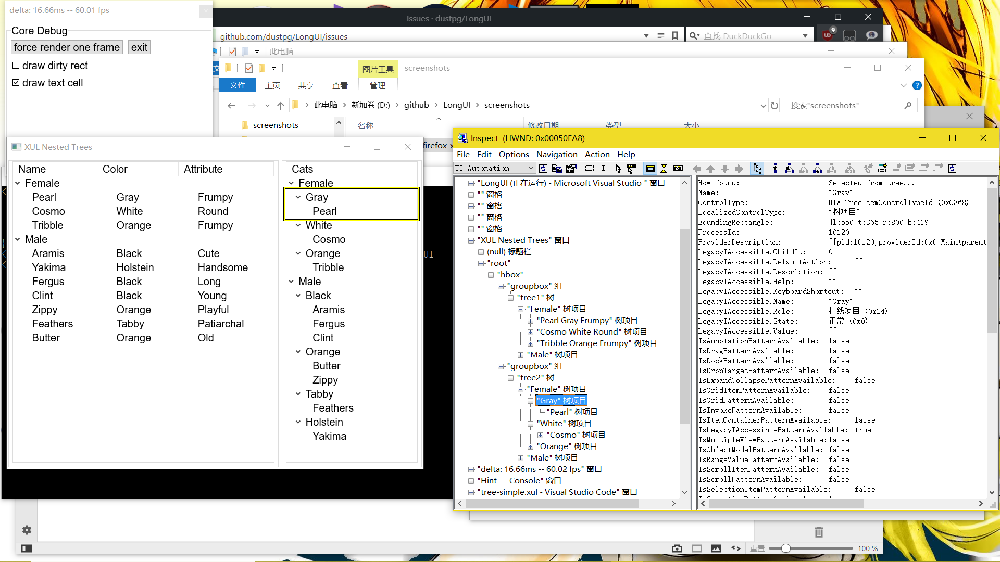
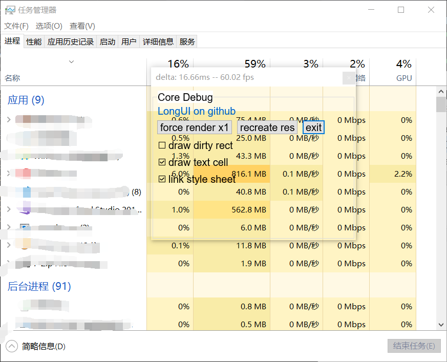

## LongUI
  
Lightweight C++ GUI Library

[INDEX索引](./INDEX.md)

## Features in LongUI
  
**Light Weight**
  - main target on LongUI
  - static-link framework, helloworld bin-file-size less than 200kb
  - for this, **no c++ exception** in LongUI

**XML User Interface Language**
  - partially compatible Mozilla's XUL (XML part)
  - partially compatible CSS to get custom look
  - built-in script interface to support your own script-lang
  - more detail, see [XUL](https://developer.mozilla.org/en-US/docs/Mozilla/Tech/XUL)

  

**High-DPI Support**
  - dynamic dpi monitor(e.g: 2 different dpi monitor) support

**Accessible**
  - support accessible even it's light-weight

  

  

**Hardware Acceleration**
  - gpu render based on direct2d now
  - dynamic gpu change support(like surface book)
  - hardware acceleration layered window support(on win8.1 and higher)

  

## License
  - LongUI under MIT License
  - more detail, see [License.txt](./License.txt) 
  
##### Minimum supported client
  - Windows 8 and Platform Update for Windows 7 [desktop apps]

---

## LongUI
  
C++轻量级GUI库

## LongUI特点

**轻量级**
  - 这是LongUI的主要实现目标
  - 设计为静态库, helloworld二进制文件不足200kb
  - 为此, LongUI**没有使用C++异常**

**XML User Interface Language**
  - 部分兼容 Mozilla的XUL (XML部分)
  - 部分兼容 CSS 用来显示自定义的样式
  - 内建的脚本接口用来支持自定义的脚本语言
  - 更多XUL相关内容: [查看这里](https://developer.mozilla.org/en-US/docs/Mozilla/Tech/XUL)
  

  

**高DPI支持**
  - 动态支持高DPI显示器(比如两个显示器不同DPI)

**Accessible**
  - 没错! 即便是轻量级还是支持了Accessible!

  

**硬件加速支持**
  - 目前使用基于Direct2D的GPU渲染
  - 支持动态切换显卡(比如surface book, 微软SB)
  - 支持硬件加速的分层(允许透明)窗口(需要Win8.1以及以上)

  

  
## License
  - LongUI是基于 MIT License的
  - 更多细节请查看[License.txt](./License.txt) 
    
##### 最低客户端支持
  - Windows 8以及 Windows 7 的平台更新[桌面应用程序]
