# Tutorial
 - [xul tutorial/xul 案内/xul 指南](./xul/xul-tutorial.md)

# Layout

 - [box](./xul/box.md) [vbox](./xul/vbox.md) [hbox](./xul/vbox.md)

# Controls

## Control List

 - [\<button>](#\<button>) [type="menu"](#\<button\ type="menu">)
 - [\<checkbox>](#\<checkbox>) [\<groupbox>](#\<groupbox>) [\<radio>](#\<radio>)
 - [\<image>](#\<image>) [\<label>](#\<label>)
 - [\<listbox>](#\<listbox>) [\<tree>](#\<tree>) \<richlistbox> 
 - \<menu> \<splitter>
 - [\<menulist(combobox)>](#\<menulist>) [editable="true"](#<menulist\ editable="true">)
 - [\<progressmeter>](#\<progressmeter>) [\<scale>](#\<scale>)
 - [\<textbox>](#\<textbox>) [multiline="true"](#\<textbox\ multiline="true">) [type="number"](#\<textbox\ type="number">) [type="password"](#\<textbox\ type="password">)
 - [\<toolbarbutton>](#\<toolbarbutton>) [type="menu"](#\<toolbarbutton\ type="menu">)


## \<button>

 - A button that can be pressed by the user.
 - ユーザが押すことのできるボタン。
 - **按钮**就是拿来按的

```xml
<button label="保存" accesskey="S"/>
```

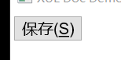

- [Button Reference](./xul/button.md)
 
## \<button type="menu">

 - A button that has a drop down menu attached to it. Pressing the button opens the menu.
 - ドロップダウンメニューの付いたボタン。ボタンを押すとメニューが開きます。
 - 附带弹出菜单的**按钮**


```xml
<button type="menu" label="View">
  <menupopup>
    <menuitem label="List"/>
    <menuitem label="Details"/>
  </menupopup>
</button>
```

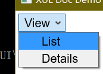

 - [Button Reference](./xul/button.md)
 - MenuPopup Reference
 - MenuItem Reference

## \<checkbox>

 - A control that may be turned on and off, typically used to create options which may be enabled or disabled.(after all, could be 'indeterminate')
 - オンにしたりオフにできるコントロール。特に有効か無効かを切り替えるオプションを作るのに使われます。(実際に、'不定'(indeterminate)にもできる)
 - **复选框**拥有开关两种状态, 可以用于控制选项中允许或者禁止两种状态(实际上可以是'不确定'(indeterminate)的状态)

```xml
<checkbox label="Show Toolbar Labels" checked="true"/>
```


- [Checkbox Reference](./xul/checkbox.md)
 
## \<groupbox>

 - A groupbox displays a labelled box around other user interface controls.
 - グループボックスは他のユーザインタフェースコントールを取り囲む、ラベルのついたボックスを表示します
 - **分组框**用于显示一个 包围其他控件分组、并带有一组标签的方框

```xml
<groupbox>
  <caption label="Network"/>
  <checkbox label="Enable Cache"/>
</groupbox>
```

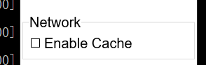

- [Groupbox Reference]
- [Caption Reference]

## \<image>
 - An image specified by a URL.
 - URL で指定された画像。
 - 通过URL显示**图像**


```xml
<image src='images/star.png' flex="1"/>
```

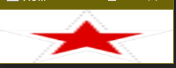

- [Image Reference]


## \<label>

 - Adds a text label to a nearby control.
 - ラベルは近いコントロールに名前となるテキストを付けるのに使われます。
 - **标签**控件可以为旁边的控件添加文本

```xml
<label control="volume" value="音量:"/>
```


- [Label Reference]

## \<listbox>

 - The listbox is used to select an item from a list of labelled items.
 - リストボックスはラベル付けされた項目のリストから、ある項目を選ぶのに使われます。
 - **列表框**用于选择一个列出的项目

```xml
<listbox>
  <listitem label="巧克力"/>
  <listitem label="ようかん"/>
  <listitem label="Bubble Gum"/>
</listbox>
```

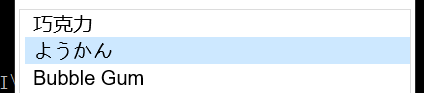

- [ListBox Reference]

## \<menulist>

 - A menulist (or combobox) is used to create a control with a drop down to select a value.
 - メニューリスト (あるいはコンボボックス) は、ある値を選択するためのドロップダウンを持つコントロールを作るのに使われます。
 - **菜单表**(或称**组合框**)用于选择弹出菜单中的一个项目

```xml
<menulist>
  <menupopup>
    <menuitem label="Lions" value="l"/>
    <menuitem label="トラ" value="t"/>
    <menuitem label="熊" value="b"/>
  </menupopup>
</menulist>
```

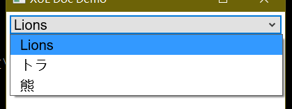

- [MenuList Reference]

## \<menulist editable="true">

```xml
<menulist editable="true">
  <menupopup>
    <menuitem label="Elephants"/>
    <menuitem label="カンガル"/>
    <menuitem label="蝙蝠"  />
  </menupopup>
</menulist>
```

- [MenuList Reference]

## \<progressmeter>

 - A progress meter is used to display the progress of a lengthy task.
 - プログレスメータは長くかかる作業の進捗状況を表示するのに使われます。
 - **进度条**用于显示当前作业的进度

```xml
<progressmeter value="40"/>
``` 

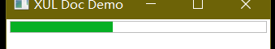

- [ProgressMeter Reference]

## \<radio>

 - A radio button is used when only one of a set of options may be selected at a time.
 - ラジオボタンは 1 回に 1 つしか選択されないオプションを作るのに使われます。
 - **单选框**就是只能单选的框

```xml
<radiogroup>
  <radio label="轻的" value="light"/>
  <radio label="重い" value="heavy"/>
  <radio label="Heay" value="hea"/>
</radiogroup>
```
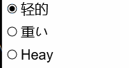

 - [Radio Reference]
 - [RadioGroup Reference]

## \<richlistbox>
## \<scale>

 - A scale(or slider) displays a bar with a thumb that may be slid across the bar to select between a range of values.
 - スケール(あるいはスライダー)は、ある範囲内で値を選択するためにバーを滑る、つまみのついたバーを表示します。
 - **比例尺**(或称**滑动条**、**滑块**)用于在给定范围中选择一个数值

```xml
<scale min="1" max="10"/>
```

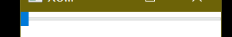

 - [Scale Reference]

## \<splitter>
## \<tab>
## \<textbox>

 - A textbox which allows a single line of text to be entered.
 - テキストを 1 行入力できるテキストボックス
 - **文本框**可以用来输入一行文本

```xml
<textbox value="firefox"/>
```

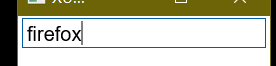

 - [TextBox Reference]

## \<textbox multiline="true">

 - A textbox which allows multiple lines of text to be entered.
 - テキストを複数行入力できるテキストボックス
 - 加上这玩意儿**文本框**就能输入复数行了

```xml
<textbox multiline="true"/>
```

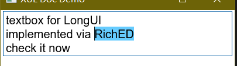

- [TextBox Reference]

## \<textbox type="number">

 - A textbox for entering numbers. Two arrow buttons are displayed for cycling through values.
 - 数値を入力するためのテキストボックス。取りうる値全体を循環する、2 つの矢印ボタンが表示されます。
 - 用于输入给定范围中的数值, 还带有两个箭头可以用于遍历范围内数值

```xml
<textbox type="number" min="1" max="20"/>
```

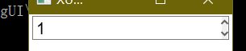

- [TextBox Reference]

## \<textbox type="password">

 - A textbox that hides the characters typed, used for entering passwords.
 - パスワードの入力に使われる、タイプされた文字を隠すテキストボックス。
 - 现在**文本框**可以输入密码, 密码文本通过给定字符进行隐藏

```xml
<textbox type="password"/>
```

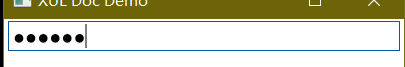

- [TextBox Reference]

## \<toolbarbutton>

 - A button that is displayed on a toolbar.
 - ツールバー上に表示されるボタン
 - **工具栏按钮**就是工具栏上的按钮

```xml
<toolbarbutton label="再読み込み"/>
```

 - [ToolbarButton Reference]
 - [Toolbar Reference]

## \<toolbarbutton type="menu">

 - A button that is displayed on a toolbar with a drop down menu attached to it.
 - ドロップダウンメニューのついた、ツールバー上に表示されるボタン
 - 带一个弹出菜单的**工具栏按钮**

```xml
<toolbarbutton type="menu" label="Show">
  <menupopup>
    <menuitem label="ツールバー"/>
    <menuitem label="ステータスバー"/>
  </menupopup>
</toolbarbutton>
```

 - [ToolbarButton Reference]
 - [Toolbar Reference]

## \<tree>

 - A tree displays a hierarchy of items in multiple columns.
 - 複列の列に項目の階層構造を表示します。
 - **树**可以用来表示树状多列的数据结构

```xml
<tree flex="1">
  <treecols>
    <treecol label="Name" flex="1"/>
    <treecol label="大きさ" flex="1"/>
  </treecols>
  <treechildren>
    <treeitem>
      <treerow>
        <treecell label="ポップコーン"/>
        <treecell label="大"/>
      </treerow>
    </treeitem>
    <treeitem>
      <treerow>
        <treecell label="ルートビア"/>
        <treecell label="小"/>
      </treerow>
    </treeitem>
  </treechildren>
</tree>
```

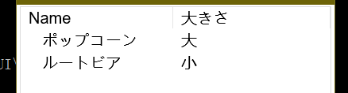

- [Tree Reference]


## \<menu>

- [Menu Reference]
