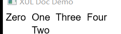

# box

 - A container element which can contain any number of child elements. If the `box` has an [orient](#orient) attribute that is set to `horizontal`, the child elements are laid out from left to right in the order that they appear in the box. If [orient](#orient) is set to `vertical`, the child elements are laid out from top to bottom. Child elements do not overlap. The default orientation is `horizontal`.
 - 複数の子要素を含むコンテナ要素。 `box` の [orient](#orient) 属性が `horizontal` にセットされていると、子要素はbox内で左から右の順に配置される。 [orient](#orient) が `vertical` だと、子要素は上から下の順に配置される。 子要素が重なることはない。 デフォルトの配置方向は `horizontal`。
 - 一个可以包含任何子元素的容器元素。`box` 的 [orient](#orient) 属性设置为`horizontal`的场合，子元素默认就会从左到右排列；同样地，[orient](#orient) 属性设置为`vertical`的场合，子元素默认会从上到下排列。子元素之间不会重叠。默认是`horizontal`。

 
## Related List

 - [Introduction to Boxes](./the-box-model.en.md)
 - [Box Element Positioning](./element-positioning.en.md)
 - [ボックス入門](./the-box-model.jp.md)
 - [ボックス要素の配置](./element-positioning.jp.md)
 - [盒模型入门](./the-box-model.zh.md)
 - [Box元素定位](./element-positioning.zh.md)

## Example



```xml
<box orient="horizontal">
  <label value="Zero"/>
  <box orient="vertical">
    <label value="One"/>
    <label value="Two"/>
  </box>
  <box orient="horizontal">
    <label value="Three"/>
    <label value="Four"/>
  </box>
</box>
```


## REF

 - [XUL-box](https://developer.mozilla.org/en-US/docs/Archive/Mozilla/XUL/box)
 - [XUL-The Box Model](https://developer.mozilla.org/en-US/docs/Archive/Mozilla/XUL/Tutorial/The_Box_Model)
