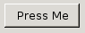

### Button

A button that can be pressed by the user. Event handlers can be used to trap mouse, keyboard and other events. It is typically rendered as a grey outset rectangle. You can specify the label of the button using the [label](./label.md) attribute or by placing content inside the button.

ユーザが押すことができる button。イベントハンドラは、マウス、キーボード、その他のイベントのトラップに使えます。これは普通、グレーの長方形で描画されます。[label](./label.md) 属性または button 内のコンテンツでボタンのラベルを指定できます。

按钮就是可以点击的东西。事件处理程序可以用来捕获鼠标、键盘和其他事件。它通常呈现为一个灰色开始长方形。您可以指定按钮的 [label](./label.md) 属性来将按钮的文字设置好，或者直接写在标签中间也行。

### Examples



```xml
<button label="Press Me"
        oncommand="alert('You pressed me!');"/>
```

### REF
 
  - [XUL-button](https://developer.mozilla.org/en-US/docs/Archive/Mozilla/XUL/button)