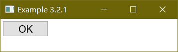
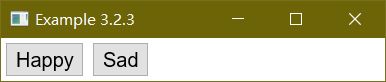
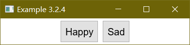
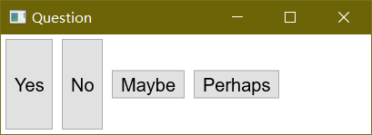

# ボックス要素の配置

前のセクションでは、ボックス内部の要素を水平方向と垂直方向に配置する方法について学びました。 実際には、ボックス内での要素の位置やサイズをさらに細かく制御する必要がある場面も多いはずです。 これらについて説明をはじめる前に、まずボックスがどのように動作するのかを確認しておきます。

要素の位置は、その要素が置かれるボックスのレイアウトスタイルによって決定されます。 例えば、水平ボックス内のボタンの位置は、前にボタンがある場合その右側になります。 また、要素のサイズは、「その要素にとって必要なサイズ」と「明示的に指定されたサイズ」の 2 つの要因によって決まります。 まず「その要素にとって必要なサイズ」は、要素の中に何があるのかによって決まります。 例えば、ボタンの幅ならば、中のテキストの長さで決まることになります。

一般的に、要素はその内容を収めるために最低限必要な大きさになります。 または、テキスト入力欄 ([textbox](./textbox.md)) のように、要素によっては、使用される際のデフォルトサイズを持っているものもあります。 ボックスは、中に置かれた要素を収めるのに十分な大きさになります。 例えば、内部に 3 つのボタンがある水平ボックスの場合、3 つのボタンの大きさに若干のパディングを加えた幅になります。


この画像で、最初の 2 つのボタンは、テキストを置くのに適切なサイズになっています。 3 番目のボタンは他より大きいですが、これはより多くの内容が含まれているためです。 ボタンが置かれているボックスの幅は、ボタンの幅の合計にボタン間のパディングを加えたものです。 ボタンの高さも、テキストを置くのに適切なサイズになっています。


## Width and height attributes

ウィンドウ内の要素のサイズを詳細に制御したい場合もあると思います。 要素のサイズを制御するための機能は数多くありますが、 手っ取り早い方法は、HTML の img タグで行なうように、 要素に `width` と `height` 属性を追加することです。 以下に例を示します。


## 例 1

 - [ソース](./source/ex_boxstyle_1.xul)



```xml
<button label="OK" width="100" height="40"/>
```

しかしながら、この方法は推奨しません。 移植や流用性が低くなりますし、XUL ファイル中で指定されたサイズが適さないテーマ (スキン) があるかもしれないからです。 もっとよい方法は、HTML のスタイルシートと同様の動作をする、スタイルプロパティを使うことです。 サイズの指定には、以下の CSS プロパティが使えます。

 - `width`: 要素の幅を指定する。
 - `height`: 要素の高さを指定する。

2 つのプロパティを両方指定した場合、設定された幅と高さの要素が作られます。 どちらか一方のサイズプロパティしか指定しなかった場合は、他方は必要に応じて計算されます。 これらのスタイルプロパティによるサイズ指定の場合、数値の後に単位をつけて指定する必要があります。(例: 80px)


## 伸縮可能な要素

**伸縮しない**要素の場合、実際のサイズを計算するのは非常に簡単です。 要素の大きさは、幅や高さが指定されている場合、単純に指定された値に従います。 サイズが指定されなかった場合、要素のデフォルトサイズとして、その内容が適切に収まる大きさになります。 **伸縮可能**な要素の場合、サイズの算出は少々トリッキーです。

伸縮可能な要素とは、0 より大きな値に設定された `flex` 属性をもつ要素のことです。 以前のセクションで説明したとおり、伸縮可能な要素は使用できるスペースに応じたサイズに伸縮します。 デフォルトサイズについては、伸縮しない要素の場合と同様に計算されます。 下の例は、このことを示しています。

## 例 2 

 - [ソース](./source/ex_boxstyle_2.xul)


```xml
<window orient="horizontal"
        xmlns="http://www.mozilla.org/keymaster/gatekeeper/there.is.only.xul">

<hbox>
  <button label="Yes" flex="1"/>
  <button label="No"/>
  <button label="I really don't know one way or the other"/>
</hbox>

</window>
```

ウィンドウは、最初は前出の画像の場合と同様に表示されます。 最初の 2 つのボタンは、適切なデフォルト幅で、3 番目のボタンはラベルが長いために、より大きなサイズになります。 最初のボタンは伸縮可能であるように指定されており、3 つの要素はすべて同じボックス内に置かれています。 ボックスの幅は、3 つのボタンすべての幅の合計 (画像では約 430 ピクセル) に初期設定されます。

ウィンドウの幅を広げると、増えたスペースを割り振るために各要素が伸縮可能かどうかチェックされます。 この場合、最初のボタンだけが伸縮可能な要素ではありますが、このボタンが広がることはありません。 これは、ボタンが置かれているボックスが伸縮可能ではないことに起因しています。 つまり、伸縮しない要素は、利用できるスペースが増えてもサイズが変化することはないため、 結果として、その中に置かれたボタンも大きくなることができず、ウィンドウが広がってもボタンは広がらないことになります。

これを解決するには、ボックスも伸縮可能にする必要があります。 そうすれば、ウィンドウを広げて新たなスペースが発生した場合、ボックスがそのスペースを利用して大きくなります。 ボックスが広がったことにより、ボックス内にも新たなスペースが作られることになり、中の伸縮可能なボタンも、増えたスペースに応じた大きさになります。 このプロセスは、入れ子になっているボックス分、必要に応じて繰り返されます。


# ボックス内の要素のまとめ方 (Packing)

子要素 2 つが置かれているボックスがあり、子要素はいずれも伸縮可能ではなく、ボックスは伸縮可能であるとします。 具体的には以下のようなものです。

## 例 3

 - [ソース](./source/ex_boxstyle_3.xul)



```xml
<box flex="1">
  <button label="Happy"/>
  <button label="Sad"/>
</box>
```

ウィンドウのサイズを変更すると、ボックスはウィンドウのサイズに応じた大きさになります。 ボタンは伸縮可能ではないので、その幅は変わりません。 そのため、ボックス内部で増えたスペースが、ウィンドウの右の方に表示されます。 しかし、ここでは増えたスペースを左側に表示させて、ボタンをウィンドウ内で右寄せにしたかったとします。

これはボックス内にスペーサーを置くことで可能ですが、たくさん指定する必要がある場合は煩雑になります。 ボックスの追加属性 `pack` を使うことで、もっと簡単に指示することができます。 この属性は、ボックス内で子要素をまとめておく位置を指定します。 水平ボックスの場合、これは、子要素の水平方向の配置をコントロールします。 垂直ボックスの場合は、子要素の垂直方向の配置をコントロールします。 以下の値が指定可能です。

 - `start` 子要素を、水平ボックスの場合左端に、垂直ボックスの場合上端に配置します。これがデフォルト値になります。
 - `center` 子要素をボックスの中央に配置します。
 - `end` 子要素を、水平ボックスの場合右端に、垂直ボックスの場合下端に配置します。

`pack` 属性はまとめたい要素を含むボックスに設定するもので、まとめたい要素自身に設定するものではありません。

以前の例を変更して、次のように、要素を中央に置くことができます。

## 例 4

 - [ソース](./source/ex_boxstyle_4.xul)



```xml
<box flex="1" pack="center">
  <button label="Happy"/>
  <button label="Sad"/>
</box>
```

今回の例は、ウィンドウのサイズが変更されると、ボタン自身で水平位置が中央になるように移動します。 この動きを前の例と比べてみてください。

# ボックス内の要素のそろえ方 (Alignment)

上の Happy-Sad の例で、ウィンドウを水平方向にリサイズすると、ボックスの幅が変わります。 さらに、ウィンドウを垂直方向にリサイズした場合、ボタンの高さがそれに応じて変わることを確認できるはずです。 これは、デフォルトで、垂直方向に伸縮可能であることが設定されているためです。

この振る舞いは、`align` 属性を使ってコントロールできます。 水平ボックスの場合、子要素の垂直方向の配置をコントロールします。 垂直ボックスの場合、子要素の水平方向の配置をコントロールします。 指定できる値は、`pack` に似ています。

 - `start` 子要素を、水平ボックスの場合は上端に沿って、垂直ボックスの場合は左端に沿って配置します。
 - `center` 子要素をボックスの中央に配置します。
 - `end` 子要素を、水平ボックスの場合は下端に沿って、垂直ボックスの場合は右端に沿って配置します。
 - `baseline` 子要素を、テキストの基準線にそって配置します。この値は水平ボックスのみ意味を持ちます。
 - `stretch` 子要素をボックスのサイズに応じて伸張させます。この値がデフォルトです。これは伸縮可能な要素と似ていますが、伸縮する方向が異なります。

`pack` 属性と同様に、`align` 属性もそろえたい要素を含むボックスに設定するもので、そろえたい要素自身に設定するものではありません。

例を示します。 下の最初のボックスは、デフォルトなので子要素を伸張させます。 2 番目のボックスは `align` 属性が設定されているので、子要素は中央に置かれます。


## 例 5

 - [ソース](./source/ex_boxstyle_5.xul)



```xml
<?xml version="1.0"?>
<?xml-stylesheet href="chrome://global/skin/" type="text/css"?>

<window id="yesno" title="Question" orient="horizontal"
        xmlns="http://www.mozilla.org/keymaster/gatekeeper/there.is.only.xul">

  <hbox>
    <button label="Yes"/>
    <button label="No"/>
  </hbox>
  <hbox align="center">
    <button label="Maybe"/>
    <button label="Perhaps"/>
  </hbox>

</window>
```

属性で指定する代わりに、スタイルプロパティ `-moz-box-pack` と `-moz-box-align`を使うこともできます。

# REF

 - [XUL-Element_Positioning](https://developer.mozilla.org/en-US/docs/Mozilla/Tech/XUL/Tutorial/Element_Positioning)
