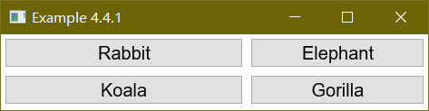
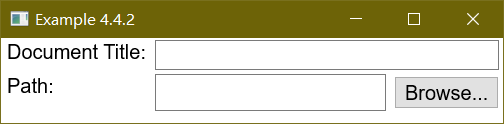
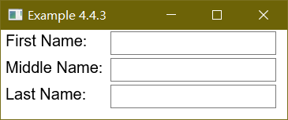
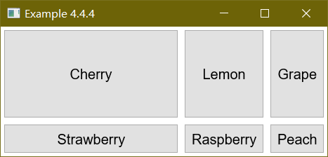
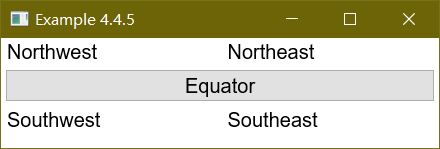

XUL には、表組み用のグリッドを作成するため、いくつかの要素が用意されています。

# XUL における表組みレイアウト

XUL では、[grid](./grid.md) 要素と、いくつかの関連要素を使用することで、要素を格子状に配置することが可能です。この要素は、HTML の `table` タグに、いくつかの点で類似していますが、全く同じではありません。例えば、グリッドは、単体では何も表示されず、いくつかの行と列からなる表形式に要素を配置するためだけに使用されます。

グリッドは、テーブルと同じように、要素をいくつかの行の中に並べて保持します。 [grid](./grid.md) 内には、2 つのことを宣言します。 1 つは [columns](./columns.md) による列に使用される情報で、もう 1 つは [rows](./rows.md) による行に使用される情報です。グリッドでも、HTML のテーブルと同じように、行の中に、ラベルやボタンなどのコンテントを置いていくことになります。なお、グリッドでもコンテントは、行に置く方が一般的ではありますが、 [rows](./rows.md) に置けば行を基本に、[columns](./columns.md) に置けば列を基本にして構成することが可能であるため、どちらに置いても構いません。 [rows](./rows.md) の方にコンテントを置いて使用する場合であっても、[columns](./columns.md) の方も、グリッド内の列のサイズや外観を指定するために使用します。あるいは、コンテントを [columns](./columns.md) に置いて、[rows](./rows.md) を外観の指定に使うことも可能です。まずは、行を使って要素を構成する場合を見ていきます。

## グリッドを宣言する

一連の行を宣言するために、[rows](./rows.md) タグを使います。 これは [grid](./grid.md) の子要素でなければなりません。 この中には、個々の行として使用する [row](./row.md) 要素を追加します。 [row](./row.md) 要素の中には、その行に置くべきコンテントを配置します。

同じように、列は [columns](./columns.md) 要素を使って宣言されます。 これも [grid](./grid.md) の子要素として置かなければなりません。 その中に、個々の [column](./column.md) 要素を置きます。 これはグリッド内のそれぞれの列に対応します。

理解を容易にするために、以下に例を示して説明します。

 - Example 1
 - [ソース](./source/ex_grids_1.xul)



```xml
<grid flex="1">
  
  <columns>
    <column flex="2"/>
    <column flex="1"/>
  </columns>

  <rows>
    <row>
      <button label="Rabbit"/>
      <button label="Elephant"/>
    </row>
    <row>
      <button label="Koala"/>
      <button label="Gorilla"/>
    </row>
  </rows>

</grid>
```

2 つの行と 2 つの列がグリッドに加えられています。各列は [column](./column.md) タグを使って宣言されています。また、各列は `flex` 属性を与えられています。 各行には 2 つの要素があり、どちらもボタンです。 それぞれの [row](./row.md) 要素の最初の要素は、グリッドの最初の列に置かれ、 各行の 2 番目の要素は、2 番目の列に配置されます。 セルを宣言するための要素は必要ないということに注意して下さい。 (HTML の `td` 要素に対応するものはありません)。 そのため、セルの内容は、直接 [row](./row.md) 要素の中に置きます。


## より多くの要素を含んだグリッド

もちろん [button](./button.md) 要素だけでなく、どんな要素でも使うことができます。 特定のセルに複数の要素を入れたい場合は、[hbox](./hbox.md) か、別のボックス要素を、入れ子にして使うことが可能です。 水平ボックス (`hbox`) は 1 つの要素ですが、必要ならその中にはいくつでも要素を入れることができます。 例を示します。

 - Example 2
 - [ソース](./source/ex_grids_2.xul)



```xml
<grid flex="1">

  <columns>
    <column/>
    <column flex="1"/>
  </columns>

  <rows>
    <row>
      <label control="doctitle" value="Document Title:"/>
      <textbox id="doctitle" flex="1"/>
    </row>
    <row>
      <label control="docpath" value="Path:"/>
      <hbox flex="1">
        <textbox id="docpath" flex="1"/>
        <button label="Browse..."/>
      </hbox>   
    </row>
  </rows>

</grid>
```

画像から、ラベルが置かれている最初の要素の列には、各行に 1 つの要素しかないという点を確認してください。 2 列目は 2 行目にボックスが含まれており、テキスト入力欄 ([textbox](./textbox.md)) と、ボタン ([button](./button.md)) の 2 つの要素が順番に配置されています。 1 つのセルの中に、ボックスを入れ子に追加していくことが可能です。別のグリッドを入れ子に加えても構いません。

この例で表示されるウィンドウをリサイズすると、テキスト入力欄は伸縮するのに、他の要素は伸縮しないことが分かります。これは、テキスト入力欄と 2 つめの列に flex 属性が追加されているためです。ラベルのサイズは変更する必要がないため、最初の列は伸縮可能である必要はありません。

列の幅の初期値は、列の中で最も大きい要素によって決められます。同様に、行の高さも、行の中の要素の大きさによって決まります。また、`minwidth` や、`maxwidth` といった属性や、`min-width` や `max-width` などの CSS プロパティで、サイズの定義を付け加えることも可能です。

## 列に基づくグリッド

また、行の代わりに [column](./column.md) 要素の内部に要素を置くことも可能です。以下の例では、[rows](./rows.md) は行数を指定するためだけに宣言されています。

 - Example 3
 - [ソース](./source/ex_grids_3.xul)



```xml
<grid>
  <rows>
    <row/>
    <row/>
    <row/>
  </rows>

  <columns>
    <column>
      <label control="first" value="First Name:"/>
      <label control="middle" value="Middle Name:"/>
      <label control="last" value="Last Name:"/>
    </column>
    <column>
      <textbox id="first"/>
      <textbox id="middle"/>
      <textbox id="last"/>
    </column>
  </columns>

</grid>
```

このグリッドには、3 つの行と 2 つの列があります。 [row](./row.md) 要素は、行数を指定するための、単なる数あわせとして置かれています。 [row](./row.md) に `flex` 属性を追加することで、その行を伸縮可能に設定することが可能です。コンテントは、各 [column](./column.md) の中に置かれています。 各 [column](./column.md) 要素内の最初の要素は最初の行に置かれ、2 番目の要素は 2 行目に、3 番目の要素は 3 行目に置かれます。

コンテントを [columns](./columns.md) と [rows](./rows.md) の両方に置いた場合、グリッド内の正しい値に配置されますが、互いに重なり合ってしまいます。これによって、スタック ([stack](./stack.md)) 要素のグリッドとよく似た効果を得ることができます。

[grid](./grid.md) 内の要素の順序によって、どの要素が前面に表示され、どの要素が背面に配置されるかが決まります。 [rows](./rows.md) 要素が [columns](./columns.md) 要素の後に置かれると、[rows](./rows.md) の方のコンテントが前面に表示されます。 [columns](./columns.md) が [rows](./rows.md) 要素の後に置かれると、[columns](./columns.md) 内の方のコンテントが前面に表示されます。 スタックの場合と同様に、マウスボタンやキー入力などのイベントは、前面の要素だけに送られます。 このために、上の例では、[columns](./columns.md) が [rows](./rows.md) の後に宣言されています。 [columns](./columns.md) が最初に置かれた場合、[rows](./rows.md) の方がイベントを捕らえてしまい、欄に入力できなくなるはずです。


## グリッドの伸縮性

グリッドが、ボックスを入れ子に組み合わせていく方法と比べた場合に持つ利点の 1 つとして、水平・垂直両方向に伸縮可能なセルが作れるということがあります。これは、`row` と `column` の両方に `flex` 属性を設定することにより可能です。以下に例を示します。

 - Example 4
 - [ソース](./source/ex_grids_4.xul)




```xml
<grid flex="1">
 <columns>
  <column flex="5"/>
  <column/>
  <column/>
 </columns>
 <rows>
  <row flex="10">
    <button label="Cherry"/>
    <button label="Lemon"/>
    <button label="Grape"/>
  </row>
  <row flex="1">
    <button label="Strawberry"/>
    <button label="Raspberry"/>
    <button label="Peach"/>
  </row>
 </rows>
</grid>
```

1 列目及び、全ての行に伸縮可能を設定してあります。このため、1 列目のセルはすべて水平方向に伸縮します。さらに、全ての `row` が伸縮可能であるため、全てのセルは垂直方向にも伸縮します。 ただし、1 行目の方が、`flex` の値が大きいため、より大きな割合で伸縮します。

第 1 行、1 列目のセル (Cherry ボタン) は、水平方向で 5 の度合、垂直方向で 10 の度合で伸縮可能です。隣のセル (Lemon) は、垂直方向にだけ伸縮します。

`flex` 属性は [grid](./grid.md) 要素にも加えることができます。これによってグリッド全体が伸縮可能になります。この指定をしない場合、グリッドは一方向にしか伸びません。

# 列のスパン

グリッドでは、セルを指定された列数や行数分だけスパンするように配置する手段は存在しません。 しかしながら、グリッドの全ての列をスパンした行か、全ての行をスパンした列を作ることは可能です。 列を全てスパンした行を作る場合、コンテントを `row` 要素ではなく、`rows` 要素の中に直接置くようにするだけです。 その中に、いくつかの要素を配置したい場合は、例えばボックス型の要素を使用して、置きたい要素を配置することで可能になります。 以下に、簡単な例を示します。


 - Example 5
 - [ソース](./source/ex_grids_5.xul)



```xml
<grid>
  <columns>
    <column flex="1"/>
    <column flex="1"/>
  </columns>

  <rows>
    <row>
      <label value="Northwest"/>
      <label value="Northeast"/>
    </row>
    <button label="Equator"/>
    <row>
      <label value="Southwest"/>
      <label value="Southeast"/>
    </row>
  </rows>
</grid>
```

ボタンは、グリッドの行 (`row`) の中に置かれていないため、グリッドの幅一杯に伸張します。 同様に、`column` の間に要素を加えることで、行をスパンする列を作ることが可能です。 この場合、加えた要素はグリッドの高さ一杯に伸張します。 必要であれば、ひとつのグリッドで両方を行っても構いません。

# REF
 
 - [XUL-Grids](https://developer.mozilla.org/en-US/docs/Archive/Mozilla/XUL/Tutorial/Grids)

