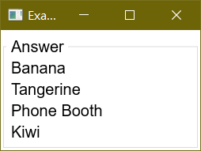
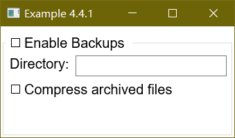
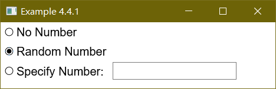

# 分组框

(分组框下面简称组框)

HTML 可以通过 `fieldset` 元素来使元素分组(**译注: HTML4.0以下版本**)，一般的会在元素的边上画一个框来显示元素的关系。比如一系列单选按钮。XUL 也通过了 [groupbox](./groupbox.md) 元素来完成相似的功能。

就像名字暗示的一样 [groupbox](./groupbox.md) 是一类box，这意味着在其中的元素可以安装box指定的形式排列。与一般的box相比groupbox有两点不同。

 - 默认的组框会画出边框，你可以使用 CSS 来改变这种行为。
 - [groupbox](./groupbox.md) 支持在边框顶部画出标题。

因为组框是一种box，你可以使用如 `orient` 及 `flex` 等属性。你可以把任何你想放入box中的元素放入组框中，无论他们有什么关系。

组框顶端的标签使用 [caption](./caption.md) 元素创建，类似于 HTML 中的legend 元素，请把 [caption](./caption.md) 作为第一个元素放入组框。

## 一个组框的例子

下面的例子显示一个简单组框。

 - 例 1 
 - [源代码](./source/ex_titledbox_1.xul)

 


```xml
<groupbox>
  <caption label="Answer"/>
  <label value="Banana"/>
  <label value="Tangerine"/>
  <label value="Phone Booth"/>
  <label value="Kiwi"/>
</groupbox>
```

以上代码表示：四条文本被一个以 Answer 为标签的box框起来，注意组框默认的定向方式为垂直定向，所以元素会排成一列。

## 更复杂的标题

你可以在 [caption](./caption.md) 元素中添加子元素构造一个更复杂的标题，比如，Mozilla的字体选择面板使用一个下拉菜单作为标题。尽管任何元素都可以在这里使用，通常的是使用下拉菜单和复选框。

 - 例 2 
 - [源代码](./source/ex_titledbox_2.xul)



```xml
<groupbox flex="1">
  <caption>
    <checkbox label="Enable Backups"/>
  </caption>
  <hbox>
    <label control="dir" value="Directory:"/>
    <textbox id="dir" flex="1"/>
  </hbox>
  <checkbox label="Compress archived files"/>
</groupbox>
```

这个例子里一个 [checkbox](./checkbox.md) 被作为标题。我看可以根据复选框是否被选中，使用脚本来控制组框中的元素是否有效。组框中包含了一个有 [label](./label.md) 和 [textbox](./textbox.md) 的水平框，文本框和组框均被设定为是可变的，所以元素会随着窗口延伸。复选框出现在组框底下是因为组框默认为垂直定向。下一章我们为find files 对话框添加一个组框。

# 单选组

 你可以使用 [radiogroup](./radiogroup.md) 把单选按钮组织在一起。 [radiogroup](./radiogroup.md) 是一种box，你可以在其中放置任何元素，并且他对 [radio](./radio.md) 按钮具有特殊的处理。

那些放在单选组里的单选按钮会被组织起来，即使它在其他的box中 。也可添加额外的元素，如下例：


 - 例 3
 - [源代码](./source/ex_titledbox_3.xul)



```xml
<radiogroup>
  <radio id="no" value="no" label="No Number"/>
  <radio id="random" value="random" label="Random Number"/>
  <hbox>
    <radio id="specify" value="specify" label="Specify Number:"/>
    <textbox id="specificnumber"/>
  </hbox>
</radiogroup>
```

注意 [radiogroup](./radiogroup.md) 不会画出边框。如果需要边框及标题请放置在 [groupbox](./groupbox.md) 中。

# REF

 - [XUL-Groupboxes](https://developer.mozilla.org/en-US/docs/Archive/Mozilla/XUL/Tutorial/Groupboxes)
