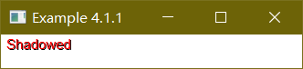
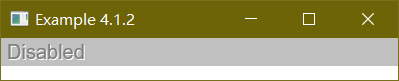
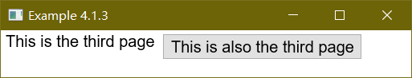

There may be need to display elements as a set of overlapping cards. The stack and deck elements can be used for this purpose.

# Containers

Each XUL box is a container that can contain any other element. There are a number of elements that are specialized types of boxes, such as [toolbars](./toolbars.md) and [tabbed panels](./tabboxes.en.md). The [box](./box.md) tag creates the simplest box with no special properties. However, the specialized types of boxes work just like regular boxes in the way they `orient` the elements inside them, but they have additional features.

In fact, many components can contain other elements. We've already seen that buttons may contain other things besides the default. A scroll bar is just a special type of box that creates its own elements if you don't provide them. It also handles the moving of the scroll bar thumb.

In the next few sections, we'll introduce some elements that are designed for holding other elements. They are all special types of boxes and allow all of the attributes of boxes on them.


# Stacks

The [stack](./stack.md) element is a simple box. It works like any other box but has the special property that its children are laid out all on top of each other. The first child of the stack is drawn underneath, the second child is drawn next, followed by the third and so on. Any number of elements may be stacked up in a stack.

The `orient` property has little meaning on a stack as children are laid out above each other rather than from side to side. The size of the stack is determined by its largest child, but you can use the CSS properties `width`, `height`, `min-width` and other related properties on both the stack and its children.

The [stack](./stack.md) element might be used for cases where a status indicator needs to be added over an existing element. For example, a progress bar might be created using a bar and a label overlaid on top of it.


## Shadowing with stacks

One convenient use of the [stack](./stack.md) element however is that you could emulate a number of CSS properties with it. For example, you could create an effect similar to the text-shadow property with the following:

 - Example 1
 - [Source](./source/ex_stacks_1.xul)



```xml
<stack>
  <label value="Shadowed" style="padding-left: 1px; padding-top: 1px; font-size: 15px"/>
  <label value="Shadowed" style="color: red; font-size: 15px;"/>
</stack>
```

Both [label](.label.md) elements create text with a size of 15 pixels. The first, however is offset one pixel to the right and down by adding a padding to its left and top sides. This has the result of drawing the same text 'Shadowed' again but slightly offset from the other. The second `label` element is drawn in red so the effect is more visible.

This method has advantages over using `text-shadow` because you could completely style the shadow apart from the main text. It could have its own font, underline or size. (You could even make the shadow blink). It is also useful as Mozilla doesn't currently support CSS text shadowing. A disadvantage is that the area taken up by the shadow makes the size of the stack larger. Shadowing is very useful for creating the disabled appearance of buttons:

 - Example 2
 - [Source](./source/ex_stacks_2.xul)



```xml
<stack style="background-color: #C0C0C0">
  <label value="Disabled" style="color: white; padding-left: 1px; padding-top: 1px;"/>
  <label value="Disabled" style="color: grey;"/>
</stack>
```

This arrangement of text and shadow colors creates the disabled look under some platforms.

Note that events such as mouse clicks and keypresses are passed to the element on the top of the stack, that is, the last element in the stack. That means that buttons will only work properly as the last element of the stack.

# Decks

A [deck](./deck.md) element also lays out its children on top of each other much like the [stack](./stack.md) element, however decks only display one of their children at a time. This would be useful for a wizard interface where a series of similar panels are displayed in sequence. Rather than create separate windows and add navigation buttons to each of them, you would create one window and use a deck where the content changes.

Like stacks, the direct children of the [deck](./deck.md) element form the pages of the deck. If there are three children of the `deck` element, the deck will have three children. The displayed page of the deck can be changed by setting an `selectedIndex` attribute on the deck element. The index is a number that identifies which page to display. Pages are numbered starting from zero. So, the first child of the deck is page 0, the second is page 1 and so on.

 - Example 3
 - [Source](./source/ex_stacks_3.xul)



```xml
<deck selectedIndex="2">
  <label value="This is the first page"/>
  <button label="This is the second page"/>
  <box>
    <label value="This is the third page"/>
    <button label="This is also the third page"/>
  </box>
</deck>
```

Three pages exist here, the default being the third one. The third page is a box with two elements inside it. Both the box and the elements inside it make up the page. The deck will be as large as the largest child, which here should be the third page.

You can switch pages by using a script to modify the `selectedIndex` attribute. More on this in the section on events and the DOM.

# REF

 - [XUL-Stacks_and_Decks](https://developer.mozilla.org/en-US/docs/Archive/Mozilla/XUL/Tutorial/Stacks_and_Decks)
