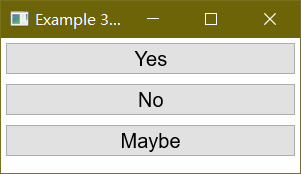
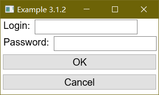
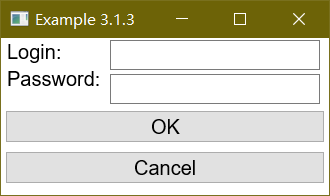

# The Box Model

## 盒模型入门

在XUL里主要的布局叫做“盒模型”。这个模型允许你把窗口分割成连续的盒子。在盒子里面元素可以按水平或垂直方向排列。通过将一系列的盒子结合在一起，使用[pack](#pack) 属性和元素的[flex](#flex)属性，你可以控制窗口的布局。

虽然盒模型是XUL元素布局的基础部份，但原理并不复杂，只有几条简单的规则。一个盒子可以将它的子盒布置在两个方向之一，水平或垂直。水平盒子将它的元素进行水平排列，而垂直盒子将它的元素进行垂直排列。你可以把一个盒子想像HTML表格中的一行或一列。除了可以在子元素中放置不同的属性还可以使用一些样式表属性来控制子盒的精确定位和尺寸。

### Box 元素

下面展示Box的基本句法：

```xml
<hbox>
  <!-- 这里的子元素将会水平从左到右排列 -->
</hbox>

<vbox>
  <!-- 这里的子元素将会垂直从上到下排列 -->
</vbox>
```
[hbox](./hbox.md)元素用来创建一个水平方向的盒子。每个放在[hbox](./hbox.md)中的元素将被水平地排成一行。[vbox](./vbox.md) 元素用来创建一个垂直方向的盒子。添加进来的元素将会被垂直地放在前一个的下面。

同样有一个普通的`box`元素默认是水平方向的，和[hbox](./hbox.md)的意思相同。然而，你可以使用`orient` 属性来控制盒子的方向。你可以设置这个属性的值为`horizontal` 去创建一个水平的盒子和`vertical`去创建一个垂直的盒子。

因此，下面两行的效果是一样的:

```xml
<vbox></vbox>

<box orient="vertical"></box>
```

下面栗子展示怎么垂直放置三个按钮。

### 例 1

 - [源代码](./source/ex_boxes_1.xul)



```xml
<vbox>
  <button id="yes" label="Yes" />
  <button id="no" label="No" />
  <button id="maybe" label="Maybe" />
</vbox>
```

这三个按钮被上层box指定为垂直方向排列。如果想变成水平排列，只需要将[vbox](./vbox.md)元素换成[hbox](./hbox.md)元素即可。


### 以登录框为例


box中可以根据需要添加对应的元素，甚至box自己。往hbox中增加元素的话，会在之前的元素右侧放置新的元素。即便一直追加新元素也不会换行，只会让窗口占用变宽。同样地，vbox中添加新的元素，会放到之前元素的下面。下面的栗子将会展示一个简单的登录窗口。

### 例 2

 - [源代码](./source/ex_boxes_2.xul)



```xml
<vbox>
  <hbox>
    <label control="login" value="Login:"/>
    <textbox id="login"/>
  </hbox>
  <hbox>
    <label control="pass" value="Password:"/>
    <textbox id="pass"/>
  </hbox>
  <button id="ok" label="OK"/>
  <button id="cancel" label="Cancel"/>
</vbox>
```

这个例子中有4个元素被垂直排列，2个是内部的[hbox](./hbox.md)元素，剩余2个是[button](./button.md)元素。注意只有外侧的box直接子元素被垂直排列，而内部的[hbox](./hbox.md)之中的元素才是被水平排列的——可以从图看出 [标签](./label.md)和[输入框](./textbox.md) 的水平排列情况。

### 输入框水平对齐

上面的对话框的布局情况可以看出——两个输入框的水平位置并没有对齐。作为改进版就让水平方向对对齐，为此需要增加新的box。


### 例 3

 - [源代码](./source/ex_boxes_3.xul)



```xml
<vbox>
  <hbox>
    <vbox>
      <label control="login" value="Login:"/>
      <label control="pass" value="Password:"/>
    </vbox>
    <vbox>
      <textbox id="login"/>
      <textbox id="pass"/>
    </vbox>
  </hbox>
  <button id="ok" label="OK"/>
  <button id="cancel" label="Cancel"/>
</vbox>
```

这里可以看出我们对齐[输入框](./textbox.md)所使用的方法——增加新的box。总之，2个[标签](./label.md)和2个[输入框](./textbox.md)放在同一个hbox中，然后分别再方到一个vbox中。内测的box是为了将元素垂直排列，中间的hbox是为了让包含[标签](./label.md)的vbox以及包含了[输入框](./textbox.md)的vbox这两个vbox水平排列。如果去掉这个hbox，那么[输入框](./textbox.md)就会跑到[标签](./label.md)下面了。

新的栗子中，「Password」[标签](./label.md)的位置过于靠上也是一个问题，实际中解决方案是使用 [grid](./grid.md) 元素进行网格对齐，后面再说吧。